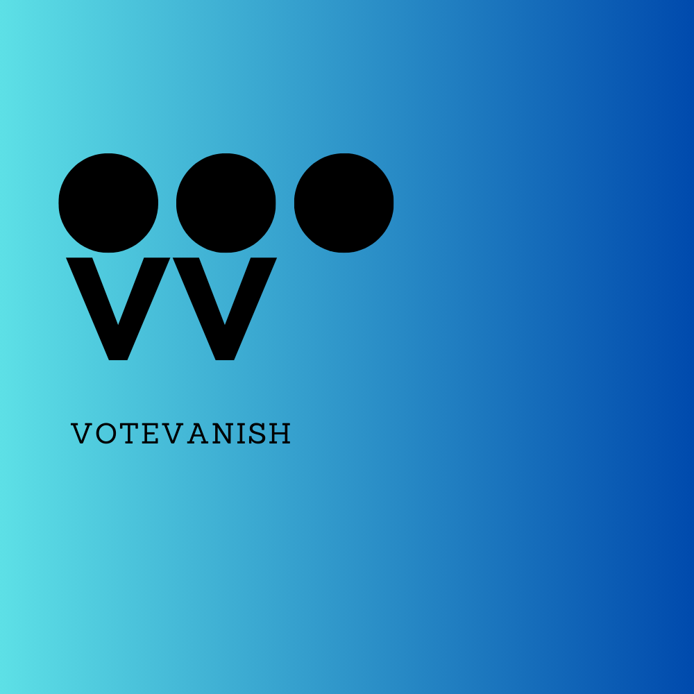

<p align="center">
  
  <div style="display: inline-block;">
    <h1>VoteVanish Discord Bot</h1>
    <p>The ultimate solution for community driven moderation on Discord! Allow your server members to collectively decide the fate of messages with a simple voting mechanism. Clearing up spam & clutter, managing controversial content, or holding out during support-less times: VoteVanish ensures your community does not lose their faith in you.</p>
  </div>
</p>

## Features

- **Vote-Delete:** Let your community vote on messages for deletion.
- **Customizable Settings:** Adjust voting thresholds and cooldowns to fit your server's needs.
- **Easy-to-Use Commands:** Simple commands make setup and usage straightforward.
- **Supports Moderation Teams:** Provides additional support to your moderation team by involving the community in content moderation.

## Installation

To install VoteVanish, ensure you have Java and Maven installed on your system. Clone the repository, compile the bot, and configure it using your Discord bot token.

```bash
git clone https://github.com/your/repository.git
cd repository-directory
mvn clean install
```

## Configuration

Modify `config.properties` to customize the bot's behavior:

```properties
token=your_discord_bot_token_here
and various other settings to modify who is allowed to vote, how many votes are needed to delete a message, etc.
```

## License
MIT License
```